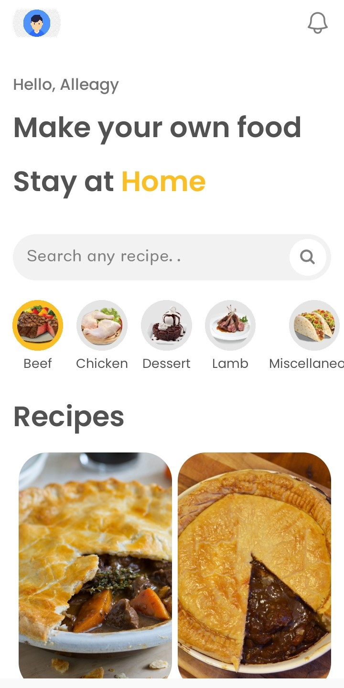
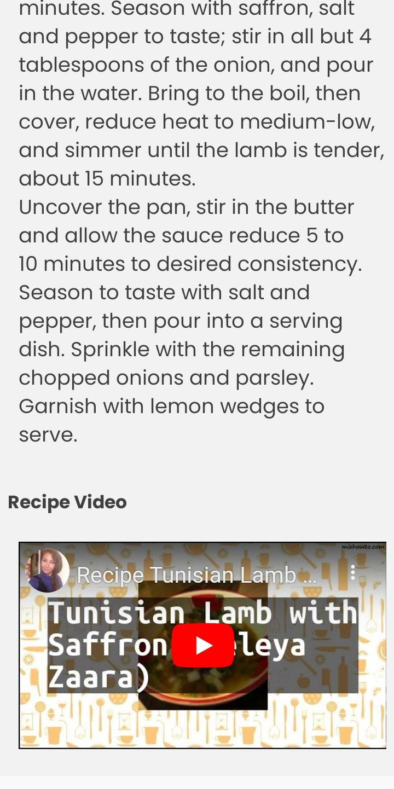

# Savory Symphony

Savory Symphony is a mobile recipe app built with React Native and Expo, utilizing the themealdb API to fetch and display various meal categories and recipes. The app allows users to explore different cuisines, view detailed meal instructions, and even watch video tutorials for meal preparation.

## Table of Contents

- [Features](#features)
- [Installation](#installation)
- [Usage](#usage)
- [Screenshots](#screenshots)
- [Dependencies](#dependencies)
- [Contributing](#contributing)
- [License](#license)

## Features

- **Explore Meal Categories:** Browse through a variety of meal categories fetched from the themealdb API.
- **View Recipes by Category:** Click on any category to see all available meals within that category.
- **Detailed Meal Page:** Access detailed information about each meal, including ingredients, preparation instructions, and miscellaneous information.
- **Video Tutorial:** Watch a video tutorial for each meal to help with preparation.
- **Responsive UI:** A seamless and responsive user interface designed for a smooth experience.

## Installation

To get started with Savory Symphony, follow these steps:

1. Clone the repository:
   ```bash
   git clone https://github.com/marvin-nyalik/Savory-Symphony.git
   ```
2. Navigate to the project directory:
   ```bash
   cd savory-symphony
   ```
3. Install the dependencies:
   ```bash
   npm install
   ```
   or
   ```bash
   yarn install
   ```
4. Start the Expo development server:
   ```bash
   npx expo start
   ```

## Usage

1. Launch the app on your preferred simulator or physical device using Expo Go.
2. Browse through the various meal categories on the home screen.
3. Click on a category to view the meals available within it.
4. Select a meal to view detailed instructions, ingredients, and other related information.
5. Watch the video tutorial to assist with meal preparation.

## Screenshots
<div style="display: flex; flex-wrap: wrap; justify-content: space-between;">
  
  
  
  
  
  
</div>

## Dependencies

- **React Native**: Framework for building mobile applications using React.
- **Expo**: A platform for making universal React applications.
- **Axios**: Promise-based HTTP client for making API requests.
- **react-navigation**: Routing and navigation library for React Native apps.
- **themealdb API**: Open API for meal recipes and information.

## Contributing

Contributions are welcome! If you would like to contribute to Savory Symphony, please fork the repository and create a pull request with your changes.

1. Fork the project.
2. Create your feature branch:
   ```bash
   git checkout -b feature/your-feature-name
   ```
3. Commit your changes:
   ```bash
   git commit -m 'your feature description'
   ```
4. Push to the branch:
   ```bash
   git push origin feature/your-feature-name
   ```
5. Open a pull request.

## License

This project is licensed under the MIT License - see the [LICENSE](LICENSE) file for details.
